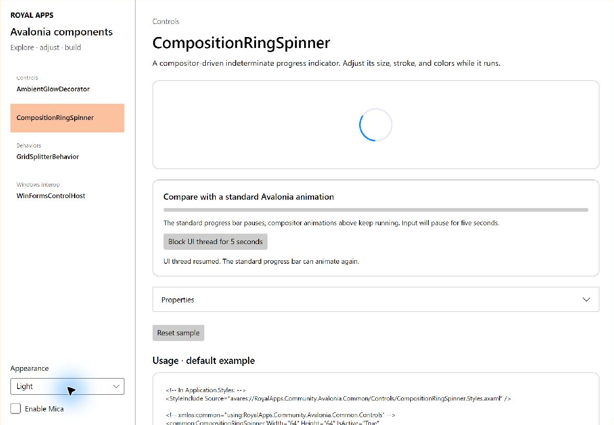
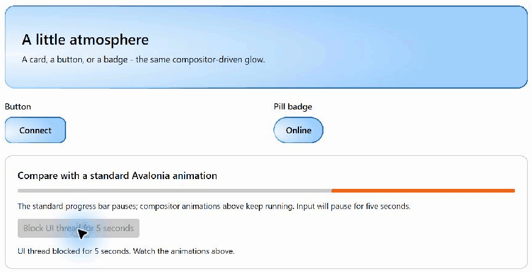
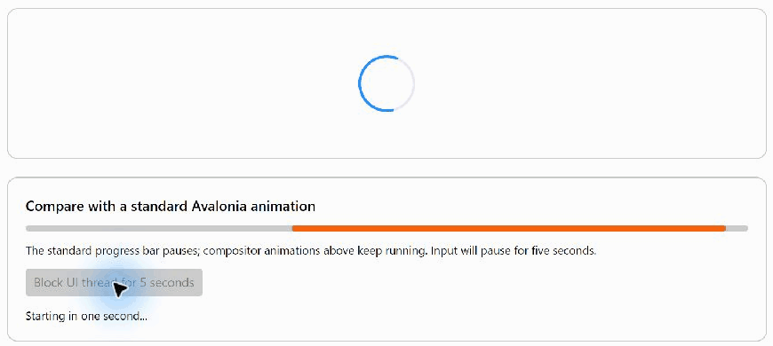
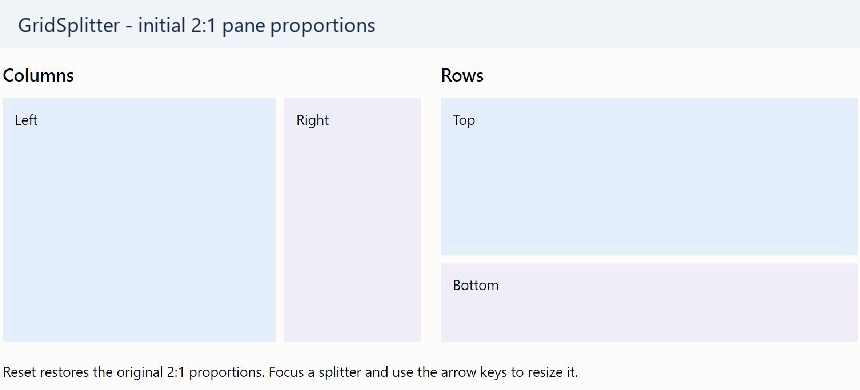
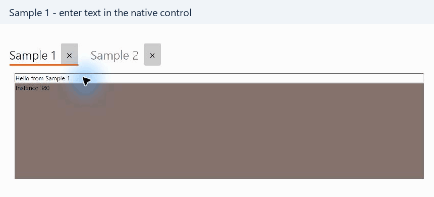

# RoyalApps.Community.Avalonia

Reusable controls and behaviors for Avalonia, plus Windows Forms hosting with explicit lifetime management.

[](https://www.nuget.org/packages/RoyalApps.Community.Avalonia.Windows)
[](https://github.com/royalapplications/royalapps-community-avalonia/blob/main/LICENSE)

## Libraries

| Library | Features | Platform |
| --- | --- | --- |
| `RoyalApps.Community.Avalonia.Common` | AmbientGlowDecorator, CompositionRingSpinner, and GridSplitterBehavior | Cross-platform Avalonia |
| `RoyalApps.Community.Avalonia.Windows` | WinFormsControlHost with persistent control state and explicit disposal | Windows |

The current source targets .NET 10 and Avalonia 12.1.2. Published package requirements can differ; check the version you install.

## Documentation

Read the [documentation](https://royalapplications.github.io/royalapps-community-avalonia/) or start with the [getting started guide](https://royalapplications.github.io/royalapps-community-avalonia/articles/getting-started), then explore:

- [Ambient glow](https://royalapplications.github.io/royalapps-community-avalonia/articles/ambient-glow)
- [Ring spinner](https://royalapplications.github.io/royalapps-community-avalonia/articles/ring-spinner)
- [GridSplitter behavior](https://royalapplications.github.io/royalapps-community-avalonia/articles/grid-splitter)
- [WinForms hosting](https://royalapplications.github.io/royalapps-community-avalonia/articles/winforms-hosting)
- [Generated API reference](https://royalapplications.github.io/royalapps-community-avalonia/api/)

See the [contributing guide](https://royalapplications.github.io/royalapps-community-avalonia/articles/contributing) for code changes, testing, and documentation updates.

## Sample application

The [component demo](https://github.com/royalapplications/royalapps-community-avalonia/tree/main/src/RoyalApps.Community.Avalonia.Demo) showcases all four components with live previews, property editors, reset actions, and usage snippets. Common samples run on Windows, macOS, and Linux; native WinForms hosting is available on Windows.

```sh
dotnet run --project src/RoyalApps.Community.Avalonia.Demo/RoyalApps.Community.Avalonia.Demo
```

<picture><source media="(prefers-color-scheme: dark)" srcset="docs/public/assets/demo/sample-browser-dark.png"></picture>

<details>
<summary>Animated component previews</summary>

| Ambient glow | Ring spinner |
| --- | --- |
| <picture><source media="(prefers-color-scheme: dark)" srcset="docs/public/assets/demo/ambient-glow-dark.gif"></picture> | <picture><source media="(prefers-color-scheme: dark)" srcset="docs/public/assets/demo/ring-spinner-dark.gif"></picture> |
| GridSplitter sample: resize and reset | WinForms: state across tabs |
| <picture><source media="(prefers-color-scheme: dark)" srcset="docs/public/assets/demo/grid-splitter-dark.gif"></picture> | <picture><source media="(prefers-color-scheme: dark)" srcset="docs/public/assets/demo/winforms-hosting-dark.gif"></picture> |

</details>

## License

[MIT](https://github.com/royalapplications/royalapps-community-avalonia/blob/main/LICENSE) · Royal Apps GmbH
